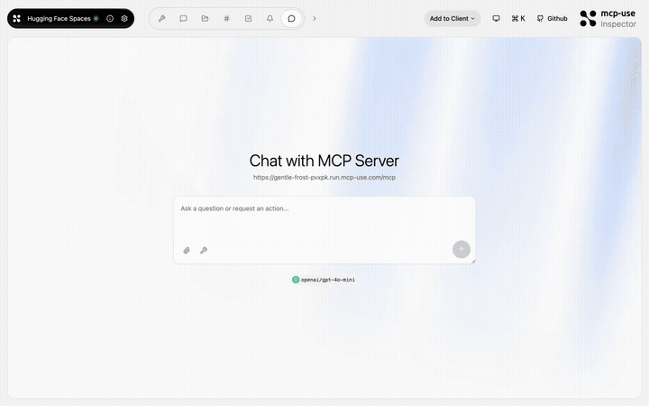

# Hugging Face Spaces — AI demos in your chat

<p>
  <a href="https://github.com/mcp-use/mcp-use">Built with <b>mcp-use</b></a>
  &nbsp;
  <a href="https://github.com/mcp-use/mcp-use">
    
  </a>
</p>

Browse and embed [Hugging Face Spaces](https://huggingface.co/spaces) directly in your chat. Search for AI demos, view trending spaces, and interact with them via embedded iframes — all without leaving the conversation.



## Try it now

Connect to the hosted instance:

```
https://gentle-frost-pvxpk.run.mcp-use.com/mcp
```

Or open the [Inspector](https://inspector.manufact.com/inspector?autoConnect=https%3A%2F%2Fgentle-frost-pvxpk.run.mcp-use.com%2Fmcp) to test it interactively.

### Setup on ChatGPT

1. Open **Settings** > **Apps and Connectors** > **Advanced Settings** and enable **Developer Mode**
2. Go to **Connectors** > **Create**, name it "HF Spaces", paste the URL above
3. In a new chat, click **+** > **More** and select the HF Spaces connector

### Setup on Claude

1. Open **Settings** > **Connectors** > **Add custom connector**
2. Paste the URL above and save
3. The HF Spaces tools will be available in new conversations

## Features

- **Search spaces** — find Hugging Face Spaces by keyword or topic
- **Trending spaces** — see what's popular right now
- **Embedded iframes** — interact with spaces directly in chat
- **Metadata** — see likes, SDK type, author, and description

## Tools

| Tool | Description |
|------|-------------|
| `search-spaces` | Search Hugging Face Spaces by keyword |
| `show-space` | Embed a specific Space as an interactive iframe |
| `trending-spaces` | Browse trending and popular spaces |

## Available Widgets

| Widget | Preview |
|--------|---------|
| `spaces-browser` |  |

## Local development

```bash
git clone https://github.com/mcp-use/mcp-huggingface-spaces.git
cd mcp-huggingface-spaces
npm install
npm run dev
```

## Deploy

```bash
npx mcp-use deploy
```

## Built with

- [mcp-use](https://github.com/mcp-use/mcp-use) — MCP server framework
- [Hugging Face API](https://huggingface.co/docs/api-inference/) — AI model hosting

## License

MIT
